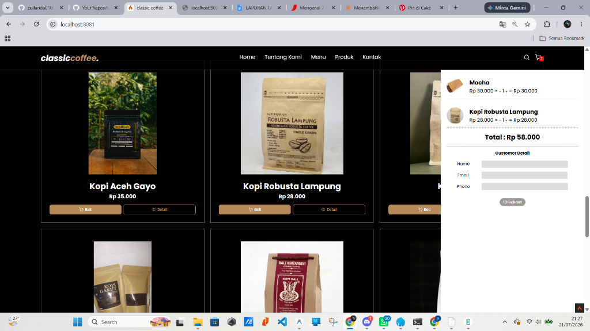
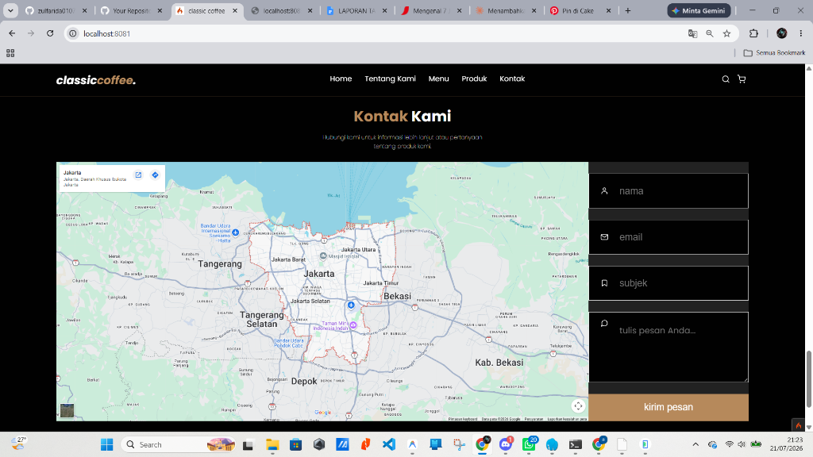
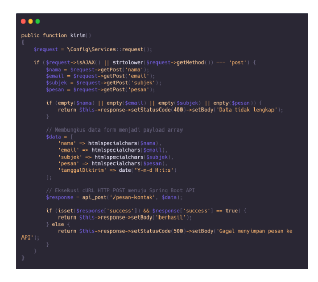
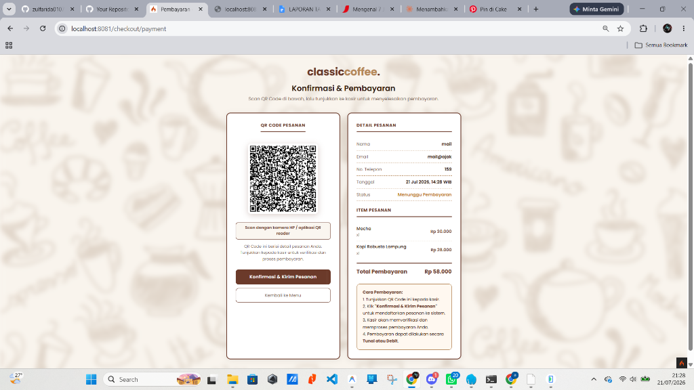
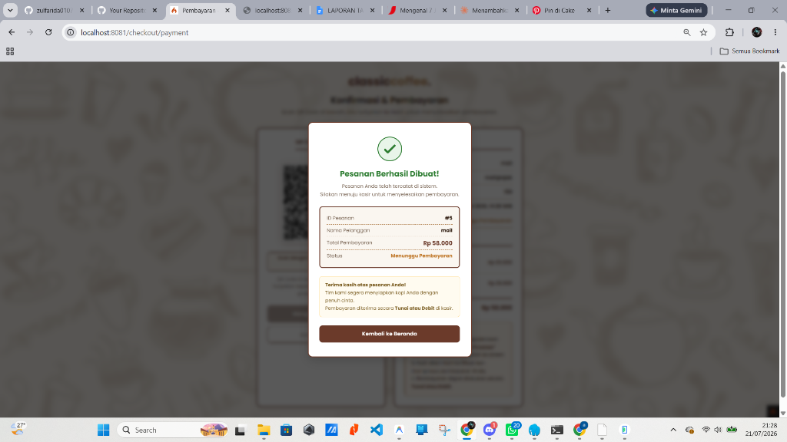
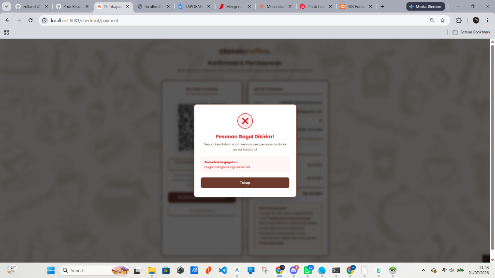
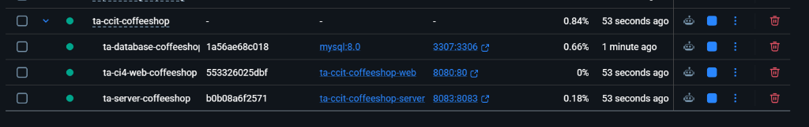

# Classic Coffee Customer Web

Classic Coffee Customer Web — A responsive CodeIgniter 4 web application for customer ordering, featuring product highlights, menu filtering, instant cart management, and dynamic QR Code invoice generation.

## Fitur Utama

- **Produk Unggulan & Menu Kami:** Pemisahan alur yang jelas antara kopi unggulan nusantara dengan daftar menu reguler.
- **Sistem Keranjang Belanja:** Manajemen keranjang belanja interaktif berbasis Alpine.js di sisi client.
- **Konfirmasi Pembayaran QR:** Halaman pembayaran dengan QR Code dinamis berbasis server-side API, lengkap dengan latar belakang doodle artistik.
- **Floating Status Modal:** Notifikasi instan (sukses/gagal/pending) yang muncul melayang di atas halaman QR Code tanpa mengalihkan halaman.
- **Formulir Hubungi Kami:** Integrasi kontak langsung pelanggan ke database.

## Keterangan Operasi CRUD

Pada sisi website customer (CodeIgniter 4), operasi data dibagi menjadi pengelolaan data lokal sisi client (Keranjang Belanja) dan pengiriman data ke server backend:

1. **Modul Keranjang Belanja (CRUD Lokal Sisi Client):**
   - **Create:** Menambahkan produk kopi atau makanan ringan ke keranjang belanja saat mengeklik tombol "Beli" / "Add to Cart".
   - **Read:** Membaca dan menampilkan daftar item belanja yang terpilih beserta ringkasan harga pada widget keranjang.
   - **Update:** Memperbarui kuantitas produk (menambah atau mengurangi jumlah item) secara dinamis di keranjang.
   - **Delete:** Menghapus item tertentu atau mengosongkan seluruh keranjang belanja.
2. **Modul Checkout & Pesanan (Create):**
   - **Create:** Mengirimkan data pemesanan (nama, nomor telepon, email, daftar item, dan total harga) ke backend Spring Boot untuk disimpan sebagai transaksi baru.
3. **Modul Hubungi Kami (Create):**
   - **Create:** Mengirimkan formulir kontak dari pelanggan (nama, email, subjek, dan isi pesan) ke server database melalui backend API.
4. **Modul Katalog Menu (Read-Only):**
   - **Read:** Membaca data katalog menu produk yang aktif dari server backend untuk ditampilkan secara dinamis kepada pelanggan.

## Teknologi

- **Framework:** CodeIgniter 4 (PHP 8.2)
- **Frontend:** Vanilla CSS, Alpine.js, HTML5
- **Database:** MySQL (dihubungkan via Spring Boot Server)
- **Web Server:** Apache (Laragon / XAMPP)

## Arsitektur Docker

Proyek ini telah dikontainerisasi menggunakan **Docker** untuk memastikan lingkungan pengembangan dan produksi yang konsisten. Sistem berjalan di atas tiga container utama yang saling terhubung dalam satu jaringan (network) Docker:

1. **`ta-database-coffeeshop`**: Container MySQL (Port `3307:3306`) yang menyimpan seluruh data aplikasi.
2. **`ta-server-coffeeshop`**: Container backend Spring Boot (Port `8083:8083`) yang terhubung langsung ke container database.
3. **`ta-ci4-web-coffeeshop`**: Container frontend CodeIgniter 4 (Port `8080:80`) yang melayani antarmuka pelanggan dan berkomunikasi dengan server backend.

Dengan menggunakan `docker-compose`, seluruh environment dapat dibangun (build) dan dijalankan secara serentak tanpa perlu mengonfigurasi Apache, PHP, Java, atau MySQL secara manual di sistem operasi host.

## Panduan Instalasi & Menjalankan Project (menggunakan Docker)

Berikut adalah panduan lengkap menjalankan & mengelola sistem terintegrasi (Web, Server, dan Database) menggunakan **Command Prompt (CMD)** via Docker:

### 1. 🚀 Menyalakan Seluruh Sistem

Buka **Command Prompt (CMD)**, lalu ketik perintah ini:

```cmd
cd C:\Dokumen
docker compose up -d --build
```

> **Penjelasan Perintah:**
> - `cd C:\Dokumen` $\rightarrow$ Pindah ke folder lokasi Master Docker.
> - `up -d` $\rightarrow$ Menyalakan seluruh container di background (agar CMD tidak terkunci).
> - `--build` $\rightarrow$ Memastikan Docker mem-build versi kode terbaru dari Web & Server Anda.

### 2. 📊 Cek Status Container

Untuk melihat apakah semua container sudah aktif dan berjalan normal:

```cmd
docker compose ps
```
*(Anda akan melihat daftar container `ta-ci4-web-coffeeshop`, `ta-server-coffeeshop`, dan `ta-database-coffeeshop` berserta port-nya)*.

### 3. 📜 Melihat Log Sistem (Real-time)

Jika ingin melihat log aktivitas server (misal saat ada transaksi pesanan masuk):

```cmd
docker compose logs -f
```
*(Tekan `Ctrl + C` untuk keluar dari tampilan log)*.

### 4. 🛑 Mematikan Seluruh Sistem

Jika sudah selesai digunakan dan ingin mematikan container:

```cmd
cd C:\Dokumen
docker compose down
```


## Pengujian & Uji Otomatis (Testing)

Proyek ini dilengkapi dengan skrip pengujian otomatis berbasis **Selenium WebDriver** dan **pytest** untuk menjamin fungsionalitas seluruh alur fitur web (39 skenario uji).

### Prasyarat Testing
1. Pastikan Python 3.x telah terpasang pada komputer Anda.
2. Pasang modul Python yang diperlukan melalui pip:
   ```bash
   pip install selenium pytest pytest-html
   ```
3. Pastikan driver browser (seperti ChromeDriver untuk Google Chrome) sesuai dengan versi browser Anda dan sudah terkonfigurasi.

### Menjalankan Uji Otomatis
1. Jalankan aplikasi web CodeIgniter 4 Anda pada port `8081`.
2. Jalankan perintah berikut melalui terminal:
   ```bash
   cd c:/Dokumen/ta-server-coffeeshop/selenium
   pytest test_ci4_web.py -v --html=report_ci4.html --self-contained-html
   ```
3. Hasil pengujian otomatis akan terekam secara detail dan laporan interaktif akan dibuat pada file `report_ci4.html`.

---

## Dokumentasi & Demo

Gunakan kolom di bawah ini untuk menambahkan tangkapan layar (screenshot), animasi GIF, atau video dokumentasi aplikasi Anda.

| Fitur | Tampilan Dokumentasi | Deskripsi |
| --- | --- | --- |
| **Halaman Beranda** |  | Halaman utama dengan visualisasi modern hero banner Classic Coffee. |
| **Tentang Kami** |  | Halaman informasi profil, dedikasi, dan latar belakang kedai kopi. |
| **Menu Kami** |  | Daftar produk kopi, non-kopi, dan pastry dengan filter dinamis. |
| **Detail Produk & Keranjang** |  | Pop-up detail menu dan pengelolaan item belanja pelanggan. |
| **Halaman Kontak** |  | Formulir saran/masukan pelanggan terintegrasi dengan Google Maps. |
| **Cuplikan Kode Form Kontak** |  | Potongan kode program PHP Controller CI4 untuk memproses pengiriman saran pelanggan ke database backend. |
| **QR Code & Detail Pesanan** |  | Halaman pembayaran yang menampilkan data pesanan dan kode QR. |
| **Modal Sukses Transaksi** |  | Floating modal sukses yang muncul setelah kasir mengonfirmasi pesanan. |
| **Modal Gagal Transaksi** |  | Floating modal merah "Pesanan Gagal Dikirim!" yang muncul ketika server API tidak dapat dijangkau. |
| **Laporan Uji Otomatis (Selenium)** |  | Bukti eksekusi uji otomatis menggunakan Selenium yang menunjukkan 39 test case sukses (PASSED). |
| **Docker Build & Up** |  | Proses kompilasi image dan inisialisasi container secara serentak menggunakan `docker compose up -d --build`. |
| **Status Container (CLI)** |  | Verifikasi container yang berjalan (Web, Server, DB) beserta port mapping-nya melalui `docker compose ps`. |
| **Docker Desktop UI** |  | Tampilan manajemen visual container, resource usage, dan logs melalui Docker Desktop. |
