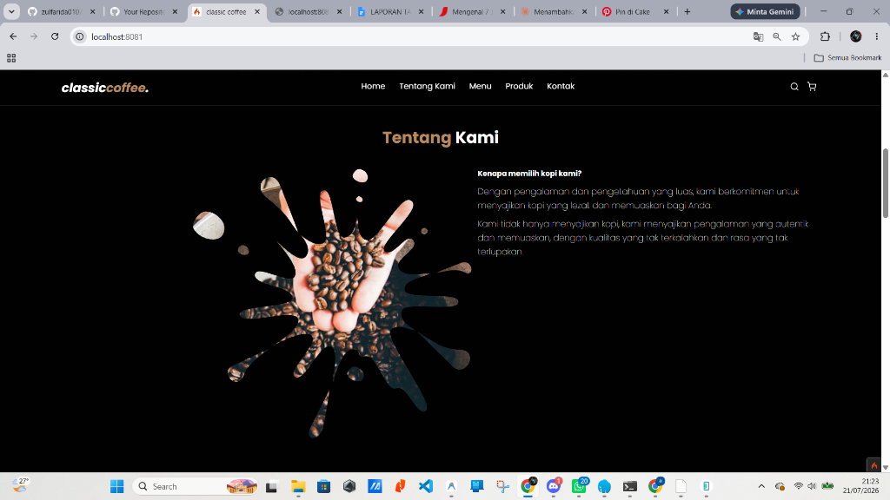
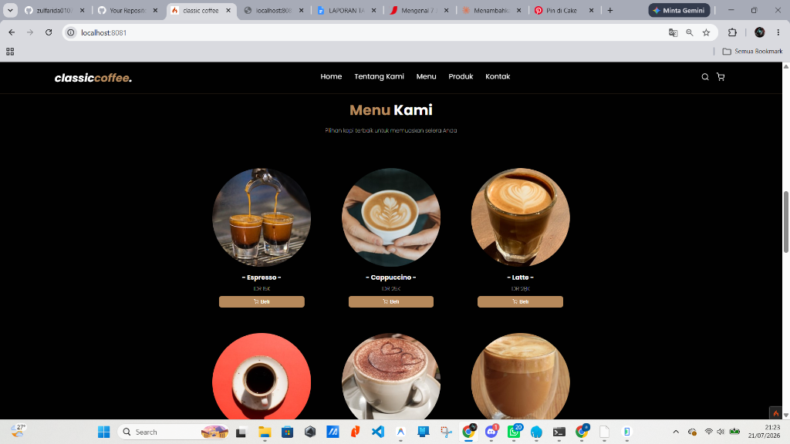
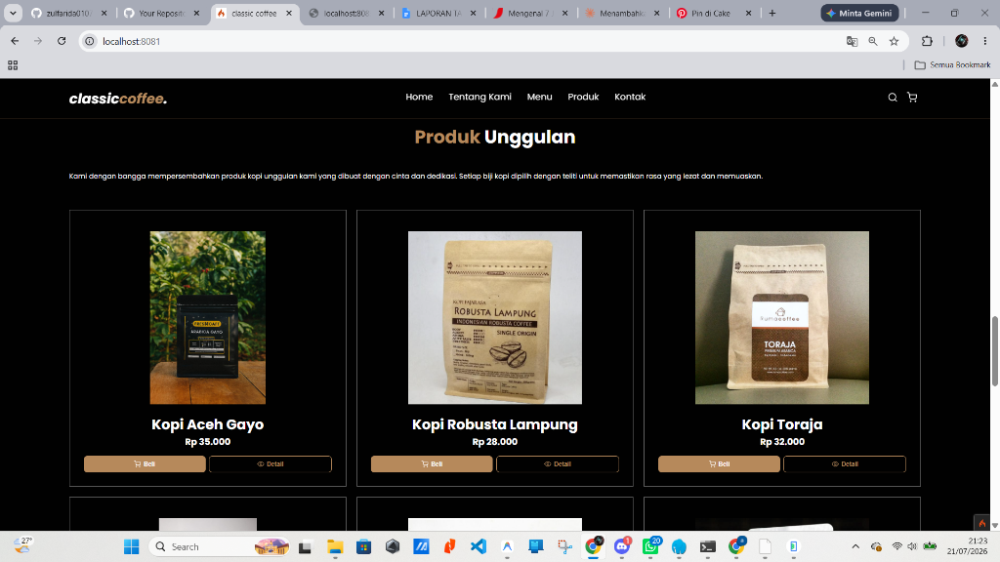
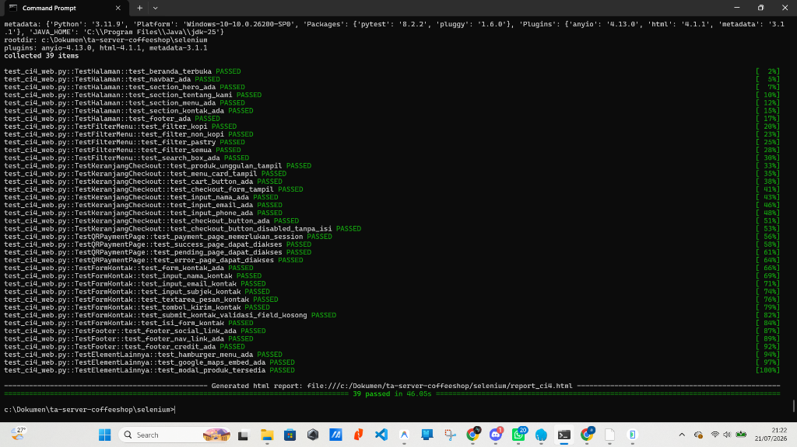

# Classic Coffee Customer Web

Classic Coffee Customer Web — A responsive CodeIgniter 4 web application for customer ordering, featuring product highlights, menu filtering, instant cart management, and dynamic QR Code invoice generation.

## Fitur Utama

- **Produk Unggulan & Menu Kami:** Pemisahan alur yang jelas antara kopi unggulan nusantara dengan daftar menu reguler.
- **Sistem Keranjang Belanja:** Manajemen keranjang belanja interaktif berbasis Alpine.js di sisi client.
- **Konfirmasi Pembayaran QR:** Halaman pembayaran dengan QR Code dinamis berbasis server-side API, lengkap dengan latar belakang doodle artistik.
- **Floating Status Modal:** Notifikasi instan (sukses/gagal/pending) yang muncul melayang di atas halaman QR Code tanpa mengalihkan halaman.
- **Formulir Hubungi Kami:** Integrasi kontak langsung pelanggan ke database.

## Keterangan Operasi CRUD

Pada sisi website customer (CodeIgniter 4), operasi data dibagi menjadi pengelolaan data lokal sisi client (Keranjang Belanja) dan pengiriman data ke server backend:

1. **Modul Keranjang Belanja (CRUD Lokal Sisi Client):**
   - **Create:** Menambahkan produk kopi atau makanan ringan ke keranjang belanja saat mengeklik tombol "Beli" / "Add to Cart".
   - **Read:** Membaca dan menampilkan daftar item belanja yang terpilih beserta ringkasan harga pada widget keranjang.
   - **Update:** Memperbarui kuantitas produk (menambah atau mengurangi jumlah item) secara dinamis di keranjang.
   - **Delete:** Menghapus item tertentu atau mengosongkan seluruh keranjang belanja.
2. **Modul Checkout & Pesanan (Create):**
   - **Create:** Mengirimkan data pemesanan (nama, nomor telepon, email, daftar item, dan total harga) ke backend Spring Boot untuk disimpan sebagai transaksi baru.
3. **Modul Hubungi Kami (Create):**
   - **Create:** Mengirimkan formulir kontak dari pelanggan (nama, email, subjek, dan isi pesan) ke server database melalui backend API.
4. **Modul Katalog Menu (Read-Only):**
   - **Read:** Membaca data katalog menu produk yang aktif dari server backend untuk ditampilkan secara dinamis kepada pelanggan.

## Teknologi

- **Framework:** CodeIgniter 4 (PHP 8.2)
- **Frontend:** Vanilla CSS, Alpine.js, HTML5
- **Database:** MySQL (dihubungkan via Spring Boot Server)
- **Web Server:** Apache (Laragon / XAMPP)

## Panduan Instalasi & Menjalankan Project

1. Pastikan Laragon atau XAMPP Anda aktif dengan PHP 8.2+.
2. Clone repository ini ke dalam direktori server Anda (misal `C:/laragon/www/ta-ci4-web-coffeeshop`).
3. Salin file `.env.example` menjadi `.env` dan sesuaikan pengaturan database serta `app.baseURL`.
4. Jalankan perintah composer untuk instalasi dependensi jika diperlukan:
   ```bash
   composer install
   ```
5. Jalankan server lokal melalui terminal:
   ```bash
   php spark serve --port 8081
   ```
6. Buka `http://localhost:8081` di browser Anda.

## Deployment / Publikasi via GitHub

Aplikasi web CodeIgniter 4 memerlukan server yang mendukung eksekusi PHP dan database MySQL (seperti VPS, Shared Hosting, cPanel, atau Cloud Hosting). Anda dapat memanfaatkan GitHub untuk mempermudah proses deployment:

### Opsi 1: Integrasi Git Sync (cPanel / Shared Hosting)
1. Hubungkan repository GitHub Anda dengan cPanel / hosting provider Anda melalui menu **Git Version Control**.
2. Lakukan clone kode langsung ke folder `public_html` hosting Anda.
3. Gunakan git pull untuk melakukan pembaruan kode secara instan saat ada perubahan baru di GitHub.

### Opsi 2: Otomatisasi CI/CD dengan GitHub Actions
Anda dapat membuat workflow deployment otomatis (misalnya mengunggah kode ke server hosting via FTP atau SSH setiap kali Anda melakukan push ke branch `main`):
1. Buat berkas konfigurasi `.github/workflows/deploy.yml` di dalam repository.
2. Konfigurasikan secret environment (seperti FTP_SERVER, FTP_USERNAME, FTP_PASSWORD) di menu Settings > Secrets and Variables > Actions pada repository GitHub Anda.

## Pengujian & Uji Otomatis (Testing)

Proyek ini dilengkapi dengan skrip pengujian otomatis berbasis **Selenium WebDriver** dan **pytest** untuk menjamin fungsionalitas seluruh alur fitur web (39 skenario uji).

### Prasyarat Testing
1. Pastikan Python 3.x telah terpasang pada komputer Anda.
2. Pasang modul Python yang diperlukan melalui pip:
   ```bash
   pip install selenium pytest pytest-html
   ```
3. Pastikan driver browser (seperti ChromeDriver untuk Google Chrome) sesuai dengan versi browser Anda dan sudah terkonfigurasi.

### Menjalankan Uji Otomatis
1. Jalankan aplikasi web CodeIgniter 4 Anda pada port `8081`.
2. Jalankan perintah berikut melalui terminal:
   ```bash
   cd c:/Dokumen/ta-server-coffeeshop/selenium
   pytest test_ci4_web.py -v --html=report_ci4.html --self-contained-html
   ```
3. Hasil pengujian otomatis akan terekam secara detail dan laporan interaktif akan dibuat pada file `report_ci4.html`.

---

## Dokumentasi & Demo

Gunakan kolom di bawah ini untuk menambahkan tangkapan layar (screenshot), animasi GIF, atau video dokumentasi aplikasi Anda.

| Fitur | Tampilan Dokumentasi | Deskripsi |
| --- | --- | --- |
| **Halaman Beranda** |  | Halaman utama dengan visualisasi modern hero banner Classic Coffee. |
| **Tentang Kami** |  | Halaman informasi profil, dedikasi, dan latar belakang kedai kopi. |
| **Menu Kami** |  | Daftar produk kopi, non-kopi, dan pastry dengan filter dinamis. |
| **Detail Produk & Keranjang** | *(Masukkan gambar di sini)* | Pop-up detail menu dan pengelolaan item belanja pelanggan. |
| **QR Code & Detail Pesanan** | *(Masukkan gambar di sini)* | Halaman pembayaran yang menampilkan data pesanan dan kode QR. |
| **Modal Sukses Transaksi** | *(Masukkan gambar di sini)* | Floating modal sukses yang muncul setelah kasir mengonfirmasi pesanan. |
| **Modal Gagal Transaksi** | *(Masukkan gambar di sini)* | Floating modal yang menginfokan kegagalan sistem lengkap dengan alasannya. |
| **Laporan Uji Otomatis (Selenium)** |  | Bukti eksekusi uji otomatis menggunakan Selenium yang menunjukkan 39 test case sukses (PASSED). |
